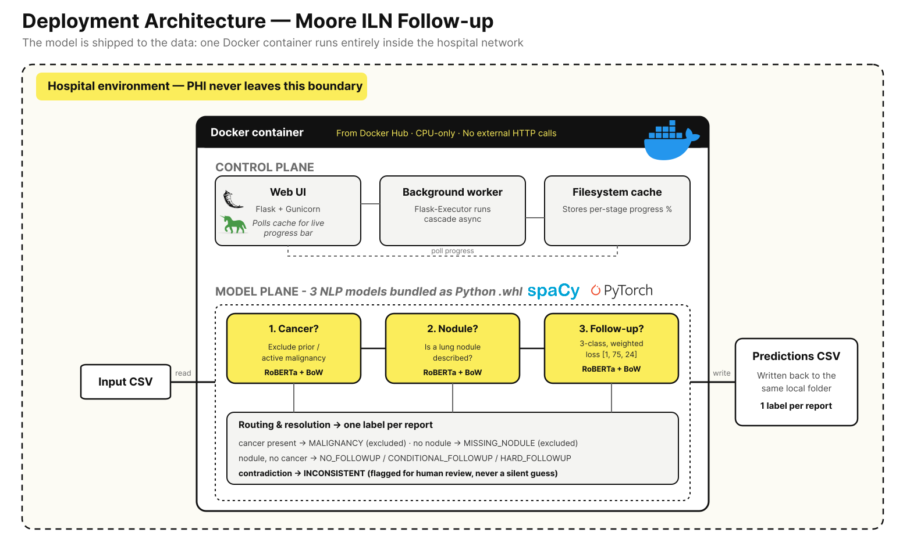
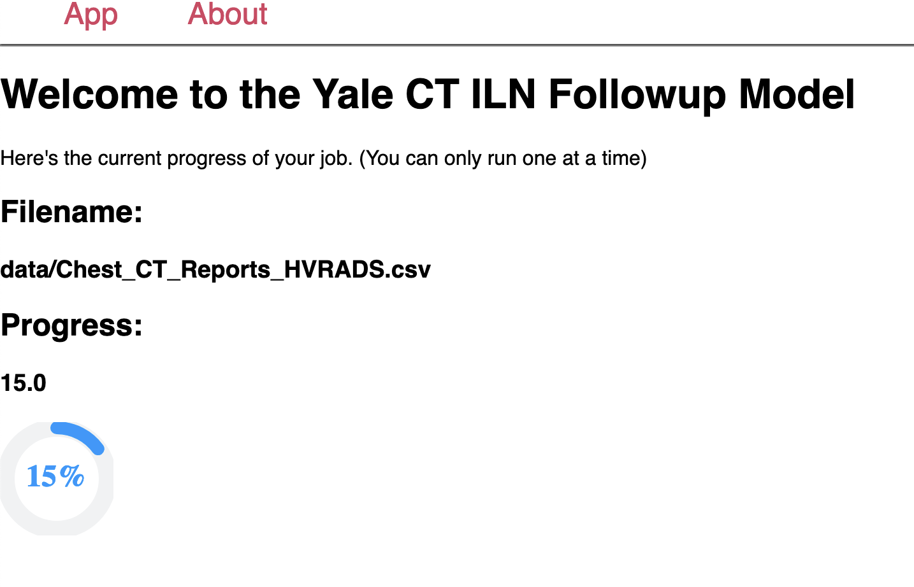

# Yale Moore CT ILN Follow-up — Deployable App

A self-contained Docker application that reads free-text ED chest CT reports and flags patients with an **incidental lung nodule (ILN)** requiring follow-up. It packages a three-stage NLP pipeline behind a simple web UI so a non-technical user at any hospital can run it on their own data — without that data ever leaving their network.

Published in *Academic Emergency Medicine* (Moore, Socrates, et al., 2025; [doi:10.1111/acem.15080](https://doi.org/10.1111/acem.15080)). Model training code: **[moore-followup](https://github.com/vsocrates/moore-followup)**. Image on [Docker Hub](https://hub.docker.com/repository/docker/vsocrates/moore/general).

---

## The problem

Patients get a chest CT in the ED for an unrelated reason; the scan incidentally catches a lung nodule. Most are benign, but a fraction are early cancer. The failure is organizational, not radiological: the visit ends, the patient goes home, and the incidental finding is never tracked to follow-up. This tool is the automated safety net that reads every ED chest CT report and surfaces the patients who need follow-up.

---

## Architecture

One container, two planes:

**Control plane** — a Flask + Gunicorn web app (2 sync workers). The user enters a local file path; a **Flask-Executor** background worker runs the cascade asynchronously so the request doesn't block, and a **filesystem cache** tracks per-stage progress that the UI polls for a live progress bar.

**Model plane** — the inference cascade, shipped as three RoBERTa pipelines bundled into the image as Python wheels (`en_moore_cancer`, `en_moore_nodule`, `en_moore_followup`):

| Stage | Question | Outcome |
|---|---|---|
| 1. Cancer? | Prior or active malignancy? | If yes → `MALIGNANCY` (excluded — not incidental) |
| 2. Nodule? | Is a lung nodule described? | If no → `MISSING_NODULE` (excluded) |
| 3. Follow-up? | What follow-up is recommended? | `NO` / `CONDITIONAL` / `HARD` follow-up |

The routing logic resolves each report to **one** label, and contradictory states resolve to `INCONSISTENT` and are flagged for human review rather than silently guessed.

---

## Key design decisions

1. **Ship the model to the data, not the data to the model.**
   - *Rationale:* running locally means PHI never leaves the hospital, sidestepping the BAAs, data-sharing contracts, and multi-site IRB friction that stall cross-institution clinical ML — at the cost of giving up centralized monitoring and one-click updates.

2. **A staged cascade, not one multiclass model.**
   - *Rationale:* gives per-stage validation, independent retraining, and an `INCONSISTENT` branch that fails safe with better performance; the accepted tradeoff is error propagation (a stage-1 miss can't be recovered downstream).

3. **CPU-only inference.**
   - *Rationale:* runs on any hospital workstation with no GPU, maximizing how many sites can adopt it; fine because this is batch work where throughput, not latency, matters.

4. **Class-weighted training for the rare class.**
   - *Rationale:* a custom weighted loss (~`[1, 75, 24]`) optimizes recall on the rare HARD class, trading some majority-class precision because a missed follow-up costs far more than a false alarm a human clears. ([Details in the training repo.](https://github.com/vsocrates/moore-followup))

---

## Usage

1. Pull `vsocrates/moore` from Docker Hub (Docker Desktop works).
2. Prepare a local CSV with two columns: **`CT_text`** (the report text) and **`ID`**.
3. Run the container, mapping its data volume to the folder holding your CSV.
4. Open the web UI, enter the file path, and watch the progress bar.
5. Predictions are written back to a CSV in the same local folder.

---

## Stack

Python 3.9 · Flask + Gunicorn · Flask-Executor · Flask-Caching · spaCy + spacy-transformers (RoBERTa-base) · CPU PyTorch · Docker.

## Known limitations

- Single-health-system training data (YNHH, 2014–2021); cross-site validation is the honest next step, and the static model needs monitoring for drift.
- Batch/CPU throughput is the first scaling wall; high volume would want a job queue with horizontal workers & multiple CPUs.
- Container ships with debug mode and an in-repo secret — fine for a single-user local deployment, but secrets should be externalized and debug disabled before any multi-user use.

## Citation

Moore CL, Socrates V, Hesami M, Denkewicz RP, Cavallo JJ, Venkatesh AK, Taylor RA. *Using natural language processing to identify emergency department patients with incidental lung nodules requiring follow-up.* Acad Emerg Med. 2025 Mar;32(3):274–283.

## License

MIT — see [LICENSE](LICENSE).
